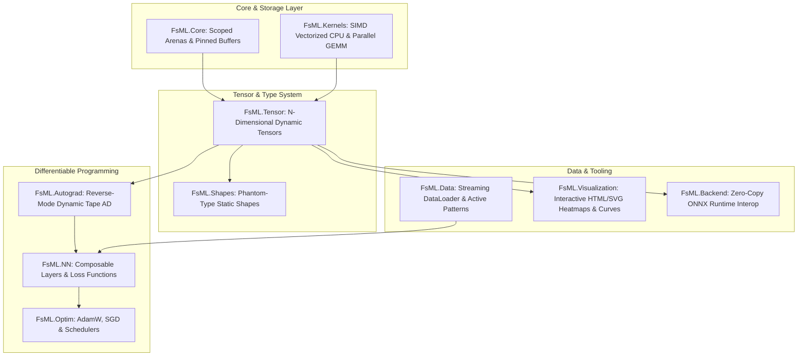

# FsML

a Next-Generation Machine Learning Framework built in F#

[]()
[](https://dotnet.microsoft.com/)
[](https://opensource.org/licenses/Apache-2.0)
[](https://fsharp.org/)

FsML is a modern, type-safe, differentiable, and high-performance machine learning framework built entirely in F#. Designed to serve as a comprehensive, superior alternative to Python's AI stack (PyTorch, NumPy, Pandas, JAX), FsML eliminates runtime shape errors at compile time, provides pure functional automatic differentiation, and enables zero-copy hardware acceleration.

---

## Why F# for Machine Learning? (The Python Replacement)

| Capability | Python (PyTorch / NumPy) | FsML (F# Framework) |
| :--- | :--- | :--- |
| **Dimension Safety** | Runtime crashes (e.g. `mat1 and mat2 shapes cannot be multiplied`) | **Compile-Time Static Shape Analysis** via Phantom Types |
| **Execution Speed** | Interpreted, GIL-locked, dynamic dispatch | **Compiled Native Code** (.NET 11 CLR, SIMD Vectorization) |
| **Memory Management** | Non-deterministic GC & reference counting overhead | **Deterministic Scoped Allocations** & Pinned Zero-Copy Buffers |
| **Data Pipelines** | Pandas memory duplication & slow row iterations | **Zero-Allocation Streaming** via Lazy `Seq` & Active Patterns |
| **Autograd Engine** | C++ bindings wrapped in dynamic Python tape | **First-Class Functional AST Tape** with Reverse-Mode AD |
| **Interactive UX** | External plotting scripts / matplotlib popups | **Polyglot Notebooks** with native interactive HTML/SVG formatters |

---

## Architectural Overview



---

## Key Pillars

### 1. Static Shape Analysis (Shapes as Types)
Eliminate dimensionality mismatches before your model ever executes:
```fsharp
open FsML.Shapes

type Batch = Batch
type SeqLen = SeqLen
type Hidden = Hidden

// [32, 128]
let input = Typed.init2D<Batch, SeqLen> (32, 128) (fun r c -> float32 (r + c))

// [128, 768]
let weights = Typed.init2D<SeqLen, Hidden> (128, 768) (fun r c -> 0.01f * float32 (r * c))

// Compiles cleanly: (Batch x SeqLen) * (SeqLen x Hidden) -> (Batch x Hidden)
let output : Tensor2D<float32, Batch, Hidden> = Typed.matmul input weights

// COMPILE ERROR (FS0001): Incompatible dimensions caught by the compiler!
// Typed.matmul input input
```

### 2. Reverse-Mode Autograd (Dynamic AST Tape)
Dynamic tape-based automatic differentiation with analytical derivatives:
```fsharp
open FsML.Autograd

let x = Value.scalar(2.0f, requiresGrad=true)
let y = (x * x) * 3.0f + (x * 2.0f) + 1.0f  // f(x) = 3x^2 + 2x + 1

Engine.backward y
printfn $"f'(2) = %f{x.Grad.Value.[0]}"       // f'(2) = 14.000000
```

### 3. Composable Neural Network Layers & Optimizers
Pipeable functional layers with state-of-the-art optimizers:
```fsharp
open FsML
open FsML.Autograd
open FsML.NN
open FsML.Optim

// Define Architecture: 2 -> 32 (ReLU) -> 32 (ReLU) -> 3 (Logits)
let l1 = Linear(2, 32)
let l2 = Linear(32, 32)
let l3 = Linear(32, 3)
let model = Sequential([ l1; l2; l3 ])

let forward (x: Value) : Value =
    x |> l1.Forward |> Ops.relu |> l2.Forward |> Ops.relu |> l3.Forward

let optimizer = AdamW(model.Parameters, lr=0.05f, weightDecay=0.001f)

// Training step
optimizer.ZeroGrad()
let logits = forward (Value.tensor batchX)
let loss = Losses.crossEntropyLoss logits batchY
Engine.backward loss
(optimizer :> IOptimizer).Step()
```

### 4. Functional Data Pipelines
Zero-allocation streaming mini-batching with F# active patterns:
```fsharp
open FsML.Data

let features, targets = Datasets.makeSpiral 100 3 (Some 42)
let dataLoader = DataLoader(features, targets, batchSize=64, shuffle=true)

for (batchX, batchY) in dataLoader.GetBatches() do
    // Stream mini-batches directly into tensor buffers
    ...
```

### 5. Interactive Notebook UX & Polyglot Formats
Native HTML and SVG rendering for VS Code Polyglot Notebooks, Jupyter, and browsers:
```fsharp
open FsML.Visualization

// Interactive matrix heatmap with color gradients and hover tooltips
let heatmapHtml = HtmlFormatters.renderHeatmap tensor

// Standalone responsive SVG training curve
let lossSvg = HtmlFormatters.renderLossCurve lossHistory
```

### 6. Zero-Copy ONNX Hardware Acceleration
Pass managed F# tensor buffers directly to native ONNX Runtime without memory copies:
```fsharp
open FsML.Backend

result {
    use! session = OnnxSession.load "model.onnx"
    let! outputs = OnnxSession.run session [ ("input_node", inputTensor) ]
    let! outputTensor = Map.tryFind "output_node" outputs
    return outputTensor
}
```

---

## Getting Started

### Prerequisites
- [.NET 11.0 SDK](https://dotnet.microsoft.com/download) or later

### Building the Framework
```bash
git clone https://github.com/your-username/FsML.git
cd FsML
dotnet build
```

### Running Verification Tests
Execute the complete 20-test automated verification suite:
```bash
dotnet fsi tests/run_tests.fsx
```

### Running Demonstrations
1. **End-to-End Neural Network Training** (Trains an MLP on spiral data and generates an HTML report):
   ```bash
   dotnet fsi examples/demo_training.fsx
   ```
2. **Static Shape Dimension Checking**:
   ```bash
   dotnet fsi examples/demo_shapes.fsx
   ```
3. **ONNX Runtime Interop**:
   ```bash
   dotnet fsi tests/test.fsx
   ```

---

## License

FsML is licensed under the **Apache License, Version 2.0**. See [LICENSE](LICENSE) for details.
